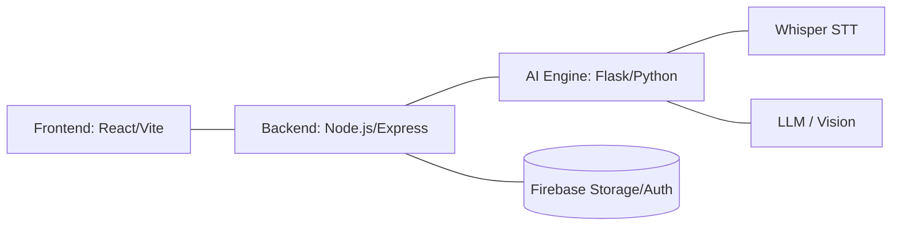

# ⚖️ NyayaSetu AI: Bridging the Gap to Justice


## 🌐 Overview
**NyayaSetu** (Sanskrit for *Legal Bridge*) is a state-of-the-art multimodal AI platform designed to democratize legal access for Indian citizens. By simplifying complex legal jargon and providing actionable guidance based on both the historic **IPC/CrPC** and the newly implemented **BNS/BNSS/BSA** frameworks, NyayaSetu empowers users to understand their rights and the legal procedures relevant to their situation.

---

## 🚀 Key Features

### 🎙️ Multimodal Input System
Interact with the law using whatever medium is most convenient:
- **Voice (STT):** Real-time transcription using `faster-whisper` for natural language queries.
- **Visual OCR:** Upload photos of legal notices or handwritten documents for instant analysis.
- **Document Parsing:** Upload PDFs or DOCX files for high-fidelity context extraction.
- **Text:** Traditional chat-based interaction with Markdown support.

### 🧠 Advanced AI Reasoning
- **Dual-Law Awareness:** Seamlessly transitions between old Indian laws and the new Bharatiya Nyaya Sanhita (2023) codes.
- **High-Fidelity Context:** Uses Vision models to analyze complex document layouts and visual evidence.
- **Automated Evaluation:** An integrated self-correction loop that scores AI responses for legal accuracy and structural compliance.

### 🛠️ Transparency & Accessibility
- **Pipeline Visualization:** Watch the AI's "train of thought" as it transcribes, extracts context, and applies legal reasoning.
- **Multi-language Support:** Fully internationalized UI (i18n) supporting English and regional Indian languages.
- **Simplified Guidance:** Choose between "Simple" mode (5 actionable points) or "Detailed" mode (Structured legal analysis).

---

## 📂 Project Structure & Architecture


NyayaSetu follows a decoupled **three-tier architecture** designed for scalability and real-time processing:



---

## 🔄 Detailed Workflow


The NyayaSetu pipeline is designed to be transparent and efficient. Here is how a user query is processed:

1.  **Ingestion**: User provides input via voice (WebM/WAV), image (JPEG/PNG), PDF, or text.
2.  **Preprocessing**: 
    - **Audio**: FFmpeg normalizes audio to 16kHz mono for optimal transcription.
    - **Images**: Tesseract.js/Vision models extract text from visual evidence.
    - **Documents**: Mammoth/PDF-parse extract structured text from legal files.
3.  **AI Orchestration**: 
    - **STT**: `faster-whisper` transcribes audio with multilingual support.
    - **Contextualization**: The AI engine merges the query with extracted document context.
    - **Legal Reasoning**: The system applies the selected mode (Simple/Detailed) and citations (IPC/BNS).
4.  **Verification**: The response is optionally sent through an **Evaluation Loop** to ensure legal accuracy and structural compliance.
5.  **Delivery**: The final advice is rendered in the frontend with a step-by-step pipeline visualization.

---

## 🏗️ Technical Architecture Details

## 🛠️ Technology Stack

| Layer | Technologies |
| :--- | :--- |
| **Frontend** | React 18, Vite, Tailwind CSS, Lucide Icons, i18next, Firebase |
| **Backend** | Node.js, Express, Multer, Mammoth, PDF-parse, Tesseract.js |
| **AI Engine** | Python 3.10+, Flask, Gemini Pro/Flash, Faster-Whisper, OpenRouter |
| **Database/Auth** | Firebase Authentication & Cloud Storage |

---

## ⚙️ Installation & Setup

### 1. Prerequisites
- Node.js (v18+)
- Python (v3.10+)
- Firebase Project Credentials

### 2. AI Engine (Python)
```bash
cd Nyaya-Setu-AI/ai
python -m venv venv
source venv/bin/activate  # On Windows: venv\Scripts\activate
pip install -r requirements.txt
python app.py
```

### 3. Backend (Node.js)
```bash
cd Nyaya-Setu-AI/backend
npm install
npm start
```

### 4. Frontend (React)
```bash
cd Nyaya-Setu-AI/frontend
npm install
npm run dev
```

---

## 📜 Legal Guardrails
NyayaSetu is built with safety at its core:
1. **Age Verification:** Explicitly highlights marriage and consent ages.
2. **Statute Verification:** Every cited section is cross-referenced with the latest Indian Statutes.
3. **Mandatory Disclaimers:** Clarifies that AI guidance is for information only and does not replace a licensed advocate.

---

## 🤝 Contributing
We welcome contributions to help make justice more accessible. Please feel free to submit Pull Requests or open issues for feature requests.

---

## 📄 License
This project is licensed under the ISC License.

---
*Created with ❤️ for Niral Thiruvizha - Nyaya Setu Team.*
